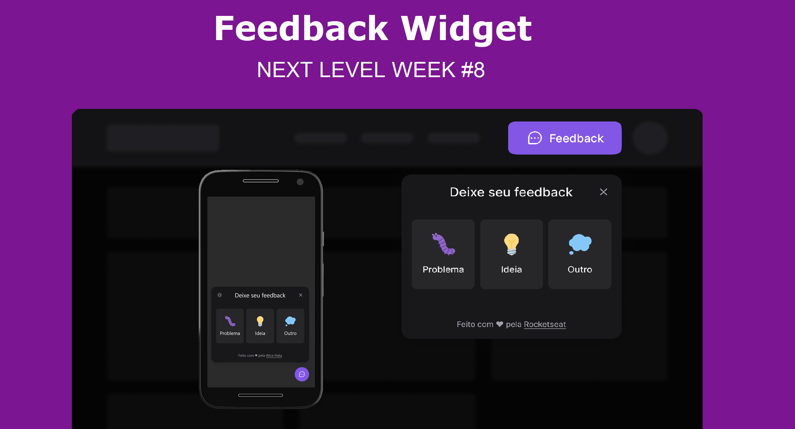

<h1 align="center">
  
</h1>

# Feedback Widget

É um projeto desenvolvido, de acordo com a NLW Return - Mission Impulse da Rocketseat.

Tem como objetivo criar um widget para coleta de feedbacks.

## Tecnologias utilizadas

- [Vite](https://vitejs.dev)
- [Typescript](https://www.typescriptlang.org/)
- [ReactJS](https://reactjs.org/)
- [Tailwind CSS](https://tailwindcss.com)
- [Headless UI](https://headlessui.dev/)
- [Phosphor react](https://phosphoricons.com/)
- [html2canvas](https://html2canvas.hertzen.com/)

## Para rodar o projeto:

Para rodar em modo de desenvolvimento use o comando `npm run dev`

## Para saber mais:

Vite é uma ferramenta de construção de frontend que visa melhorar a experiência do desenvolvedor.

O Tailwind CSS é um framework CSS e foi instalado com o PostCSS.

PostCSS é uma ferramenta para automatizar operações CSS de rotina.

Headless UI são componentes UI com acessibilidade feitos com Tailwind CSS.
